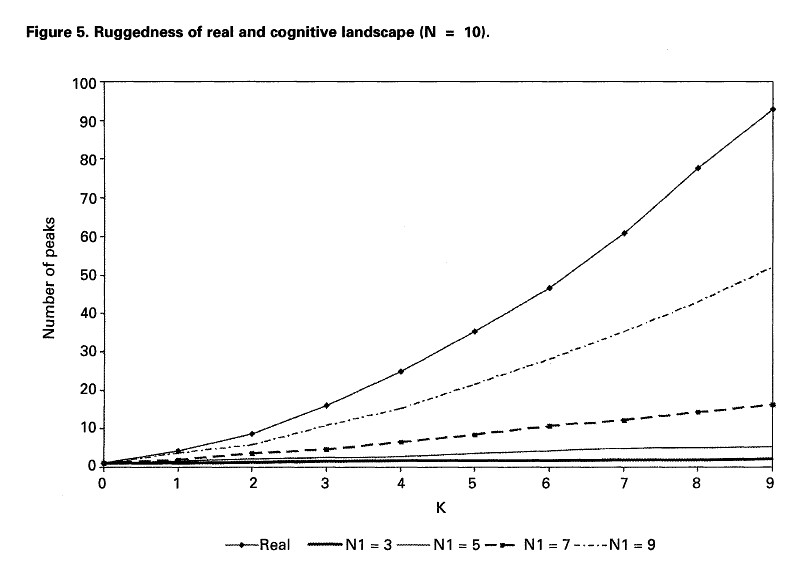
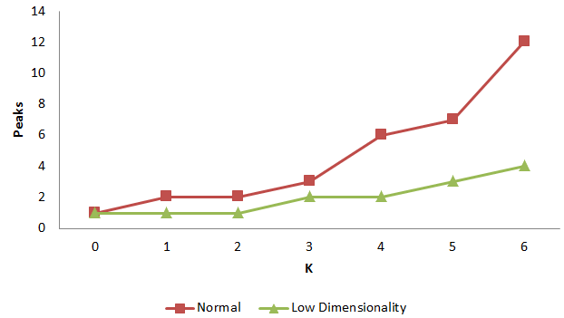

``Giovanni Gavetti``와 ``Daniel Levinthal``은 2000년에 **Administrative Science Quarterly**에 흥미로운 논문을 발표했다. ``Looking Forward and Looking Backward: Cognitive and Experimental Search``라는 제목의 이 논문은 ``Simon``의 제한된 합리성(bounded rationality)를 NK 모델로 표현하는 방법을 보여준다. ``rNKm``을 활용하면 Gavetti & Levinthal (2000)의 아이디어를 간단하게 활용할 수 있다. 본 글은 제한된 합리성을 표현하는 구체적인 실천법으로 제안된 Low Dimensionality (LD)를 구현하는 방법을 소개한다.


## Low Dimensionality

보다 자세한 내용은 Gavetti & Levinthal (2000)의 논문에서 *Fitness landscape and cognition* 섹션을 참고하기를 바라고, 본 튜토리얼은 간단히 개념만 설명한다.

1. 인지(cognition)은 landscape의 표현법에 종속됨: Landscape의 위치를 표현하는 binary combination이 곧 cognition과 같음
1. 더 낮은 차원수(lower dimensionality)는 참된 차원의 landscape의 반영
1. 어떤 actor의 인지 차원이 N1이라면 $N1<=N$
1. N1의 인지 공간(즉, low dimensionality의 공간)에서 어떤 actor가 마주칠 cognitive representation은 $2^(N-N1)$개의 진짜 landscape의 구성점들로부터 축소됨

결국, N1이 감소하면 축소가 되는 점들이 증가되어 인지적 표현은 지극히 평탄하게 변한다. 이것은 어떤 지점들을 마치 불도저로 밀어버리는 것과 마찬가지다. 예를 들어 어떤 actor가 가진 인지적 표현이 '1 0 0 0'이고 이것은 N=4인 경우에 해당된다고 하자. 만약 N1으로 감소된 인지 차원이 첫 번째와 두 번째의 요소만 알고 나머지는 무지하다면 이는 '1 0 * *'로 지워진 것처럼 보인다. N1=2이고 축소될 공간의 수는 $2^(4-2)$로 결정된다. 이제 축소된 공간을 재구축하려면 모든 경우의 수를 생각하여 평균을 구하는 방법을 취한다고 하자. 다시 돌아가 재구축에 기여하는 각각의 요소는 '1 0 0 0', '1 0 1 0', '1 0 0 1', 그리고 '1 0 1 1'이다. 평탄하게 변한다는 의미를 살펴보자. 표현 '1 0 0 0'의 이웃(즉, 한 요소만 바뀐 것) 중의 하나는 '1 0 1 0'이다. 세 번째 요소만 다르다. 그런데 '1 0 * *'의 경우이기 때문에 세 번째의 변화는 의미가 없어진다. 즉, 재구축에 기여하는 요소는 '1 0 0 0'과 마찬가지로 '1 0 0 0', '1 0 1 0', '1 0 0 1' 그리고 '1 0 1 1'이기 때문에 N1이 가정된 경우 '1 0 0 0'이나 '1 0 1 0'이나 landscape에서의 적합도 값은 차이가 없다. 따라서 N1에 해당되지 않은 인지적 표현의 경우 이웃들은 원래의 landscape가 가진 적합도를 평균값으로 대체하여 버리는(은유적인 의미에서 불도저로 밀어버린) 모양으로 바뀐다. 바꾸어 말하면, 어떤 요소들의 조합은 **그렇지 않을까**라는 대중적 인식으로 대체된다.

## Low Dimensionality 부분들을 생성

rNKm이 low dimensionality를 표현하는 핵심은 N1의 마커들을 활용하여 낮은 차원수의 부분집합들을 생성하는 것이다. 이것은 ``gen_lowdim_fraction()``함수를 통해 이루어진다.

```{r, eval=TRUE}
require(rNKm)
#N1의 masking은 1번과 2번이므로 c(1,2)
#표현하려는 landscape의 agent의 위치는 c(1,0,0,0)이라면,
gen_lowdim_fraction(c(1,0,0,0),c(1,2))
```

그리고
```{r, eval=TRUE}
gen_lowdim_fraction(c(1,0,1,0),c(1,2))
```

## Low Dimensionality를 가진 Landscape를 생성하기

함수 ``gen_lowdim_fraction()``을 바탕으로 ``landscape_gen_lowdim()``함수는 low dimensionality를 표현하는 landscape를 생성한다.
```{r,eval=TRUE}
fun <- landscape_gen_lowdim(N=4,K=1,N1=c(1,2))
fun(c(0,0,0,0))
fun(c(1,0,0,0))
fun(c(1,0,1,0))
fun(c(1,0,1,1))
```

위의 예를 보면, N1의 마스킹 값으로 c(1,2)를 주었다. 이는 agent가 1번과 2번의 component만을 인식의 대상으로 삼고 3, 4번의 경우 bounded rationality의 지배를 받는다는 뜻이다. 참된 landscape와 결과를 비교하기 위해 난수 구조(random structure)를 외부에서 지정해주는 경우를 생각해보자.

``landscape_structure_uniform()``함수는 주어진 N과 K의 값을 바탕으로 일양분포(uniform distribution)의 난수 구조를 생성하여 반환한다. 이를 ``landscape_gen()``이나 ``landscape_gen_lowdim()``에 파라미터 g로 입력하면 동일한 난수 구조를 유지한다. 물론 ``landscape_structure_uniform``에 random seed를 정해주거나 함수 외부에서 set.seed()로 random seed 값을 정해줄 수도 있다. 여러 이유로 나는 두 번째 방법을 추천한다.

```{r, eval=TRUE}
set.seed(1) #random seed=1
rnd_str <- landscape_structure_uniform(N=4,K=1)
fun_full <- landscape_gen(N=4,K=1,g=rnd_str)
fun_ld <- landscape_gen_lowdim(N=4,K=1,N1=c(1,2),g=rnd_str)
```

``fun_full()``과 ``fun_ld()``에 대해 agent가 취할 수 있는 두 개의 인지적 표현인 1 0 0 0과 1 0 1 0은 서로 다른 결과를 보여준다. fun_full()의 적합도 값은 서로 다르지만, fun_ld()의 경우는 평탄한 landscape에 있으니 서로 같아진다.

```{r, eval=TRUE}
fun_full(c(1,0,0,0))
fun_full(c(1,0,1,0))
fun_ld(c(1,0,0,0))
fun_ld(c(1,0,1,0))
```

적합도 값이 크고 작은 것의 비교는 여기에서 의미가 없다. 왜냐하면 계산된 적합도는 표준화되지 않았기 때문이다. 최대값과 최소값을 바탕으로 실수 벡터를 표준화시키는 함수는 ``scales::rescale()``이다. 이 함수를 사용하면 주어진 벡터의 모든 값을 0과 1사이로 표준화한다. 시뮬레이션의 목적 상 두 개 이상의 경우를 비교하고자 한다면 최종 결과를 표준화하는 것이 현명하다.

```{r, eval=TRUE}
library(scales)
rnd_str
rescale(rnd_str)
```

## Peak 탐색 실험



위의 그림은 **Gavetti & Levinthal**이 2000년에 *Administrative Science Quarterly* 45권에 제시한 것이다. 그림을 보면 Low Dimensionality가 있을 경우 peaks의 수가 적다는 점을 확인할 수 있다. {rNKm}로 모델링할 때 이와 일치하는 결과를 얻을 수 있다. 



N=6, N1=2로 설정한 landscape_gen_lowdim()을  세 차례 반복 시뮬레이션의 평균값을 그린 그림이다.
