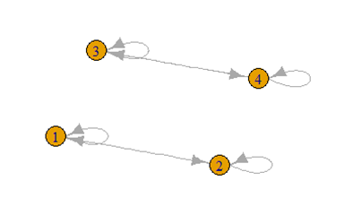
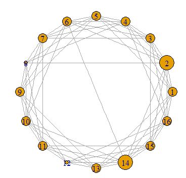
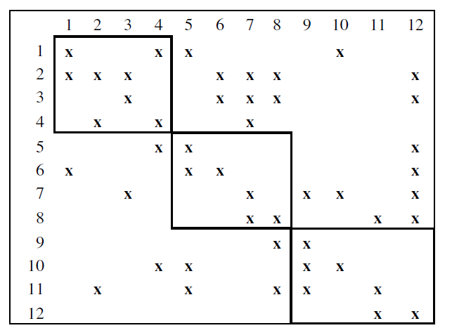
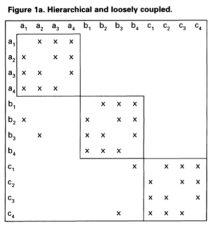
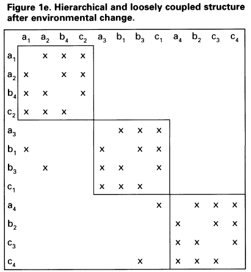

## Modularity

Landscape에 사용된 요소들을 어떤 부품으로 보고 그들 사이의 의존성 관계를 활용하는 모듈화(Modularity) 디자인에 대해 살펴보자. 요소들의 이름은 다르고, 모듈의 모양에 대한 해석도 다를 수 있지만, 기본적으로 landscape의 근간이 되는 influence matrix의 형태에 의미를 두려는 노력은 여러 연구자들에 의해 반복되어 왔다(e.g., Arlmirall & Casadesus-masanell 2010; Ethiraj & Levinthal 2004a, 2004b, 2009; Ethiraj et al. 2008; Ghemawat & Levinthal 2008).

모듈의 예는 쉽게 찾을 수 있다. 휴대전화 상품은 배터리 모듈과 전화기 모듈로 구성된다. 배터리 모듈 안에는 제어 유닛과 충전 유닛 그리고 배터리가 있다. 배터리 모듈 안의 충전 유닛과 전화기 모듈의 디스플레이 유닛은 별로 관계가 없다. 하지만 전화기의 제어 유닛과 배터리의 제어 유닛은 서로 신호를 주고 받는다. 완전히 독립된 유닛들끼리 모여 하나의 모듈을 구성할 수도 있고, 모듈 간의 소통을 위한 별도의 유닛들도 존재할 수 있다. 유닛들 간에는 기능적 역할 때문에 발생되는 의존성이 있다. 배터리 모듈은 충전 유닛을 통해 전하를 모은다. 충전 유닛은 제어 유닛의 명령을 받아 언제 충전을 그만둘 것인지 결정한다. 기능적인 연결성을 고려할 때 이와 같은 의존성은 유닛으로 구성된 네트워크를 구성하는 바탕이 된다(Ethiraj & Levinthal 2009).

## Modularity 디자인과 igraph

R의 유명한 패키지 중 하나인 {igraph}를 활용해서 모듈을 시각화하고 이를 landscape 생성에 반영하는 과정을 살펴보자. 예제들을 실행하려면 ``igraph``와 ``intergraph`` 패키지가 설치되어야 한다. ``install.packages()`` 명령어로 설치하자.

```{r eval=F}
library(igraph)
library(intergraph)
g <- graph(c(1,1, 2,1, 1,2, 2,2, 3,3, 4,3, 3,4, 4,4))
plot(g)
```

생성된 그래프의 모양은 다음과 같다. 1번과 2번, 그리고 3번과 4번이 서로 독립된 모듈이다.



igraph로 디자인한 모듈을 influence matrix로 바꾸는 작업은 {intergraph}의 *as.matrix.igraph()*함수가 담당한다.

```{r echo=F, message=F}
library(igraph)
library(intergraph)
g <- graph(c(1,1, 2,1, 1,2, 2,2, 3,3, 4,3, 3,4, 4,4))
library(rNKm)
```

```{r eval=T}
inf_mat <- intergraph:::as.matrix.igraph(g,"adjacency")
inf_mat
```

컴마 3개를 연속해서 붙이면 패키지의 함수를 바로 가져다 쓴다. 이제 inf_mat을 contribution matrix로 바꾸고 landscape의 fitness value를 반환하는 함수를 생성하자.

```{r eval=T}
cont_mat <- convert_influence_contribution(inf_mat)
land_fun <- landscape_gen(N=dim(inf_mat)[1],K=2)
land_fun(c(1,1,1,1))
land_fun(c(1,0,0,1))
```

### Graph 생성 알고리즘 활용

모듈의 형태를 확률적으로 결정하거나 혹은 그래프 생성 알고리즘을 활용하는 등, 다양한 방법을 선택할 수 있다. 본 예제에서는 {igraph}의 sample graph generator의 알고리즘을 활용해서 influence matrix를 생성하는 방법을 알아본다. Duncan Watts와 Steven Strogatz (1998)가 소개한 **Small World Network**를 시작 차원 1, 연결 평균 노드의 수 4, 되감기 확률을 1%로 한 16개 노드의 네트워크를 생성하자. 

```{r eval=F}
my.small_world <- sample_smallworld(1,16,4,0.01)
V(my.small_world)$size <- scales:::rescale(igraph:::degree(my.small_world),c(5,20))
plot(my.small_world,layout=layout.circle)
``` 

노드(혹은 vertex)의 크기를 degree로 한 플롯을 그려보면 다음과 같다.



```{r eval=T,echo=F}
my.small_world <- sample_smallworld(1,16,4,0.01)
```

Influence matrix를 생성하려면,

```{r eval=T}
inf_mat <- intergraph:::as.matrix.igraph(my.small_world,"adjacency")
diag(inf_mat) <- 1
inf_mat
```

Contribution matrix를 생성하여 landscape fitness value를 구해보자.

```{r eval=T}
cont_mat <- convert_influence_contribution(inf_mat)
N=16
K=max(rowSums(inf_mat))
fun <- landscape_gen(N,K,PI=cont_mat)
fun(c(1,1,1,1,0,0,0,0,1,1,1,1,0,0,0,0))
```

아래의 그림은 Ethiraj et al. (2008)의 Nonmodular Structure의 예를 보여준다.



1번 element는 4, 5 그리고 10번 element에 의존적이나($K_1=3$), 2번 element는 1,3,6,7,8,12번에 의존한다($K_2=6$). 따라서 element 별로 다른 복잡도를 보인다는 사실에 주의해야 한다. {rNKm}은 복잡도가 모든 element에 같은 경우(balanced data)와 다른 경우(unbalanced data)를 모두 다룰 수 있지만, K는 항상 최대치가 입력되어야 한다.

## Module과 Subsystem

어떤 landscape 내에서 하부시스템(subsystem)이 존재할 경우 각각의 조합위치에 대한 payoff 값을 계산하는 방식은 달라져야 한다. Almirall & Casadesus-masanell (2010)의 NK 시뮬레이션 디자인은 주어진 확률공간에서 인식 가능한 두 개의 하부 시스템이 있는 경우의 좋은 예가 된다. 간단한 예를 통해 복수의 하부시스템이 존재할 경우 {rNKm}으로 처리하는 방법에 대하여 알아보자.

우리는 독립된 두 개의 모듈이 있고 이들이 각각의 혁신성과에 따라 평가되는 것이 공정하다고 간주한다. 즉, $\alpha=<s_1,s_2,...s_{N/2}>$과 $\beta=<s_{N/2+1},s_{N/2+2},\dots,s_N>$이 있어 이들이 하나의 상품을 구성한다고 하자. 알파를 전력 모듈, 베타를 디스플레이 모듈이라고 부르자. 전력 모듈의 payoff는 전력 모듈에 참여하는 unit들 내에서 고려된다. 디스플레이 모듈의 변이와 전력 모듈의 변이 사이에 어떤 설명 관계가 존재하지 않는 이상 이들의 상호 조합이 가정되지 않은 폐쇄적(closed) 상태가 가정된다. 따라서 두 개의 모듈은 landscape의 총점을 계산하기 위해 필요한 서로 다른 두 개의 하부시스템을 생성한다. 

{rNMm}은 fitness value를 계산하기 위한 독립된 시스템을 생성한다. 우리가 가진 ``landscape_gen()``이나 ``landscape_gen_lowdim()``은 시스템(R에서는 function)을 반환하는 factory 함수이다. 따라서 같은 형태의 확률 구조(stochastic structure)를 공유하는 독립된 두 개의 시스템을 손쉽게 디자인 할 수 있다. 아래의 예를 보자.

```{r eval=T}
N=6
K=2
landscape_sp <- landscape_structure_uniform(N=N,K=K)
fun1 <- landscape_gen(N=N,K=K,sub_idx=c(1,2,3),g = landscape_sp) #subsystem for alpha
fun2 <- landscape_gen(N=N,K=K,sub_idx=c(4,5,6),g = landscape_sp) #subsystem for beta
test_policy = c(1,1,1,0,1,0)
fitness1 = fun1(test_policy)
fitness2 = fun2(test_policy)
fitness = mean(c(fitness1,fitness2))
fitness
```

어떤 상품의 구성에 관한 정책을 ``test_policy``라고 부르고 우리는 module $\alpha$의 관련 정보를 **sub_idx** 파라미터로 넘긴 ``fun1()``을 만들었다. 또한 $\beta$의 경우 **sub_idx=c(4,5,6)**으로 하여 4, 5, 그리고 6번 unit을 하나의 하부시스템의 구성품으로 묶었다. 전체 적합도 점수는 이들 하부시스템의 평균으로 간주했다. 위에서 주목해야 할 것은 payoff를 계산할 때 사용된 이득(gain) 확률분포인 landscape_sp이다. {rNKm}은 seed 제어를 통해 완전히 동일한 확률분포를 미리 생성하여 다른 하부시스템에 넘기도록 설계되었다. 

## Ethiraj and Levinthal (2004)의 환경변화와 모듈화 디자인

조직의 성과와 환경변화의 관련성을 연구에 NK 모델을 적용한 Ethiraj and Levinthal (2004)은 influence matrix의 구조적 특성을 유지한 채 환경변화로 생긴 혼란을 적절히 표현하는 방법을 보여준다. 다음 그림은 이들 논문의 413페이지에 실린 Figure 1a이다.



조직의 각 부서(department)가 같은 알파벳으로 표기되었다. 환경변화의 충격은 이들 부서 간의 상호작용을 바꾸어 버린다. 예를 들어 예전에는 협조하지 않던 b와 c부서가 a와 긴밀히 협조해야 하는 상황이 벌어질 수 있다. 가령 a는 고객만족을 담당하는 부서이고 b가 정보화 관련부서, c가 재무관련 부서인데 외부 환경의 변화에 따라 이들 간의 의존도가 높아진다면 다음과 같은 그림이 생겨날 수 있다.



두 그림을 비교해보면 구조적 특성은 유지한 채 의존성을 확립하는 주체들이 뒤바뀌었다. 이 상황을 {rNKm}으로 모델링해보자. 우선 influence matrix를 구축한다.

```{r eval=T}
library(igraph)
library(intergraph)
inf_graph <- graph.empty() + vertices(c(paste("a",1:4,sep="_"),paste("b",1:4,sep="_"),paste("c",1:4,sep="_")))
inf_graph <- inf_graph + edges(c('a_1','a_2', 'a_1','a_3', 'a_1','a_4'))
inf_graph <- inf_graph + edges(c('a_2','a_3', 'a_2','a_4'))
inf_graph <- inf_graph + edges(c('a_3','a_1', 'a_3','a_2', 'a_3','a_4'))
inf_graph <- inf_graph + edges(c('b_1','b_2', 'b_1','b_3', 'b_1','b_4'))
inf_graph <- inf_graph + edges(c('b_2','a_1', 'b_2','b_1', 'b_2','b_3', 'b_2','b_4'))
inf_graph <- inf_graph + edges(c('b_3','a_2', 'b_3','b_1', 'b_3','b_2', 'b_3','b_4'))
inf_graph <- inf_graph + edges(c('b_4','b_1', 'b_4','b_2', 'b_4','b_3'))
inf_graph <- inf_graph + edges(c('c_1','b_4', 'c_1','c_2', 'c_1','c_3', 'c_1','c_4'))
inf_graph <- inf_graph + edges(c('c_2','c_1', 'c_2','c_3', 'c_2','c_4'))
inf_graph <- inf_graph + edges(c('c_3','c_1', 'c_3','c_2', 'c_3','c_4'))
inf_graph <- inf_graph + edges(c('c_4','b_3', 'c_4','c_1', 'c_4','c_2', 'c_4','c_3'))
inf_mat <- intergraph:::as.matrix.igraph(inf_graph)
diag(inf_mat) <- 1
inf_mat
```

다음으로 새로운 configuration을 주고 환경변화가 반영된 influence matrix를 계산한다.

```{r eval=T}
new_conf <- c('a_1','a_2','b_4','c_2',
              'a_3','b_1','b_3','c_1',
              'a_4','b_2','c_3','c_4')
new_inf_mat <- redesign_influence_matrix(inf_mat,new_conf)
```

위 예에서 객체 ``new_inf_mat``은 list형 데이터이며 $a와 $b 객체를 가지고 있다. 각각에 대해 출력해보면 그 차이를 알 수 있다.

```{r eval=T}
new_inf_mat$a
new_inf_mat$b
```
